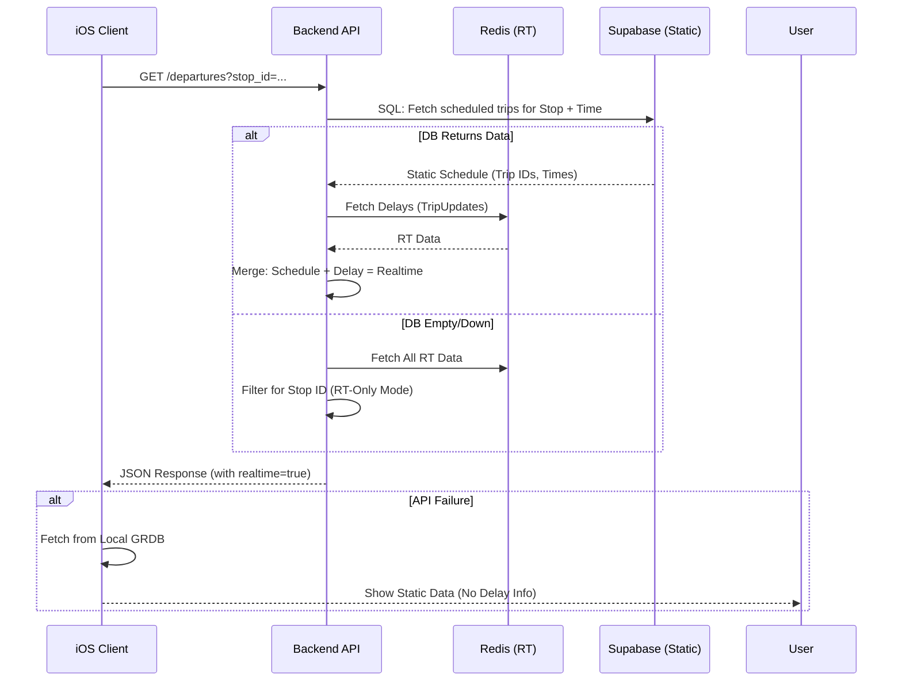

# Current System State & Architecture Map
Date: 2025-11-22

## 1. Database Schema (Supabase/PostgreSQL)

The system uses a **GTFS Pattern Model** optimized for efficient retrieval and storage.

### Core Tables
| Table | Primary Key | Description | Key Relationships |
|-------|-------------|-------------|-------------------|
| `agencies` | `agency_id` | Transit agencies (Sydney Trains, etc.) | - |
| `routes` | `route_id` | Transport routes (T1, 333, etc.) | FK -> `agencies` |
| `stops` | `stop_id` | Physical locations with PostGIS geography | Self-ref `parent_station` |
| `patterns` | `pattern_id` | Unique stop sequences (Variant of a Route) | FK -> `routes` |
| `pattern_stops` | `(pattern_id, stop_sequence)` | Junction table with time offsets | FK -> `patterns`, `stops` |
| `trips` | `trip_id` | Specific scheduled runs | FK -> `patterns`, `routes`, `calendar` |
| `calendar` | `service_id` | Service availability (Mon-Sun) | - |
| `calendar_dates`| `(service_id, date)` | Service exceptions (Holidays) | FK -> `calendar` |

### Spatial Features
- **PostGIS Enabled:** `stops` table uses `geography(Point, 4326)` column `location`.
- **Indexing:** GIST index on `location` for fast KNN (K-Nearest Neighbors) and `ST_DWithin` queries.
- **Trigger:** `stop_location_trigger` auto-updates `location` from `stop_lat`/`stop_lon` on insert/update.

## 2. Real-Time Architecture (Decoupled 3-Layer)

The system implements a robust fallback mechanism across three layers of data availability.

### Layer 1: API Aggregation (`departures.py`)
- **Role:** Orchestrates fetching and merging data.
- **Logic:**
    1.  **Try Static + RT:** Fetches static schedule from Supabase (Layer 3) and merges with Redis (Layer 2).
    2.  **Fallback RT-Only:** If Supabase returns no static data (or is down), it attempts to build valid departures *purely* from Redis GTFS-RT data (`_build_rt_only_departures`).
    3.  **Offline Fallback:** The Client (iOS) falls back to local GRDB if API fails.

### Layer 2: Real-Time Cache (Redis)
- **Format:** Gzipped JSON blobs.
- **Keys:**
    - `tu:{mode}:v1`: TripUpdates (Delays, formatting).
    - `vp:{mode}:v1`: VehiclePositions (Occupancy).
- **Modes:** `sydneytrains`, `metro`, `buses`, `ferries`, `lightrail`.

### Layer 3: Static Data (Supabase)
- **Source:** NSW Transport GTFS (Open Data).
- **Ingestion:** `gtfs_service.py` parses raw text files into the Pattern Model.
- **Querying:** `exec_raw_sql` RPC is used for performant complex joins (Trips -> Patterns -> Stops).

## 3. iOS Architecture (SydneyTransit)

### Data Layer
- **Repository Pattern:** `DeparturesRepositoryImpl` abstracts data sources.
- **Dual Source:**
    1.  `APIClient`: Fetches from Backend `GET /v1/departures`.
    2.  `DatabaseManager`: Local GRDB database for offline support.
- **Decoding:** Custom `init(from decoder:)` in `Departure.swift` to robustly handle missing fields (preventing crashes on partial data).

### UI Layer (SwiftUI)
- **MVVM:** `DeparturesViewModel` manages state.
- **State Management:**
    - `departures`: Array of `Departure` structs.
    - `loadedDepartureIds`: Set for client-side deduplication.
    - `refreshDeparturesInPlace`: "Sliding Window" logic for auto-refresh.
- **Components:**
    - `DeparturesView`: Main list with Pull-to-Refresh.
    - `DepartureRow`: Renders time, delay color, occupancy.

## 4. Data Flow Diagrams

### Real-Time Departure Flow

